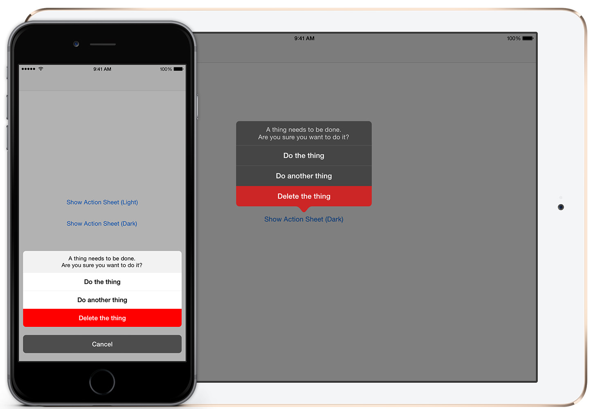

# TOActionSheet

`TOActionSheet` is an iOS UI control providing a modal prompt control, similar to `UIActionSheet`. 
Unlike `UIActionSheet`, it can be very heavily re-themed, and avoids the delegate model by using blocks for each button.

## Features
* Pre-defined light and dark themes.
* Every colour is editable, and subscribes to `UIAppearence`.
* A custom header view may be specified as the top element.
* Plays a bubbly pop-up animation.
* Button callback is provided via blocks.
* Subscribes to sudden trait collection changes, such as split screen on iPad Air 2.

## Technical Requirements
iOS 7.0 or above.

## License

`TOActionSheet` is licensed under the MIT License, please see the LICENSE file.
